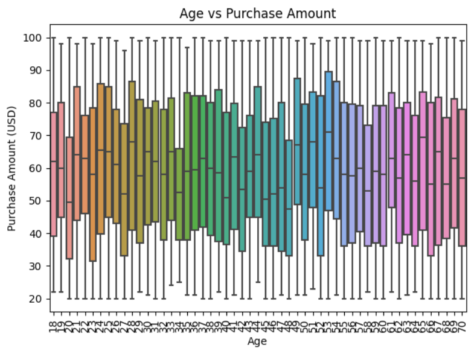

# 🛒 Customer Shopping Trends Analysis

วิเคราะห์ข้อมูลพฤติกรรมการซื้อของลูกค้าจาก Kaggle เพื่อค้นหา Insight และจัดกลุ่มลูกค้าด้วย K-Means Clustering

## 📌 Objective
- วิเคราะห์ข้อมูลพฤติกรรมลูกค้า (อายุ, เพศ, ประเภทสินค้า, ช่องทางซื้อ)
- ใช้ K-Means เพื่อแบ่งกลุ่มลูกค้า
- นำเสนอผลลัพธ์แบบกราฟ

## 🔍 Key Insights (ก่อน Clustering)
- ลูกค้าวัย 26-35 ปีมียอดใช้จ่ายเฉลี่ยสูงที่สุด
- ผู้หญิงมักซื้อผ่านช่องทางออนไลน์
- กลุ่มอายุ 30+ มีความหลากหลายในการเลือกสินค้า
- สินค้า Category 'Clothing' และ 'Accessories' เป็นที่นิยมสูง

## 📊 หลังใช้ K-Means Clustering
- Cluster 0: ลูกค้าวัยทำงาน (26–35 ปี) ใช้จ่ายสูง ซื้อผ่าน Online
- Cluster 1: ลูกค้าวัยรุ่น (18–25 ปี) เน้นสินค้าราคาต่ำ ซื้อบ่อย
- Cluster 2: ลูกค้าอายุ 45+ มีแนวโน้มซื้อแบบอนุรักษ์นิยม

## 🖼️ ตัวอย่างกราฟ


## 🧪 วิธีรัน
```bash
pip install -r requirements.txt
jupyter notebook Shopping_trend.ipynb
